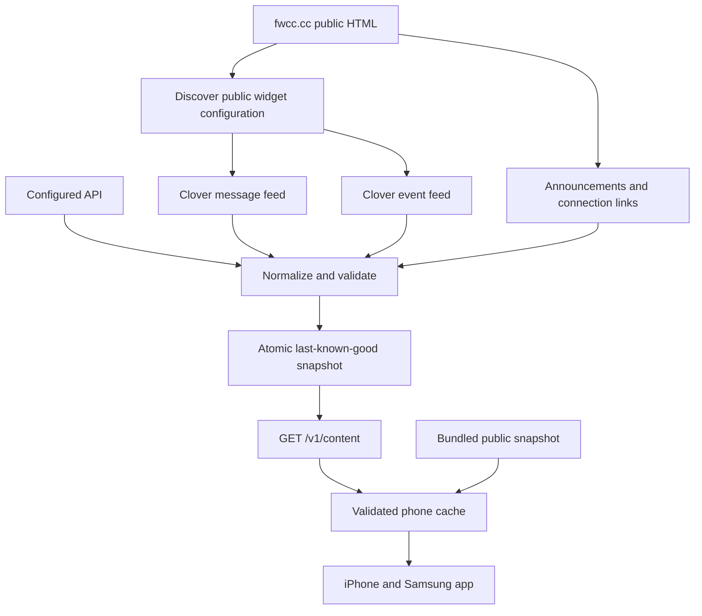

# Content architecture

## Direct phone refresh

iPhone and Android now run `mobile/src/content/website.ts` directly. The snapshot generator imports this same parser through `server/scraper.ts`. The mobile-safe Cheerio slim entry point parses HTML without executing page scripts; public Clover feeds supply messages and events. No content server or API key is required for this mode.

The app starts with its bundled snapshot, restores a validated device cache, and refreshes on opening, foreground, manual refresh, and every 15 active minutes. Only a complete validated result replaces existing content. Network or parsing failures retain saved content and show a refresh-unavailable status. A successful refresh is saved for offline use. Background refresh while the app is closed is not scheduled.

The TestFlight profile explicitly selects `EXPO_PUBLIC_CONTENT_MODE=website`. Native builds also default to direct website refresh when no content URL is configured. Web previews continue to use `EXPO_PUBLIC_CONTENT_URL` or saved content because browser CORS restrictions differ from native networking.

The optional server architecture below remains available for APIs requiring secrets, centralized parser fixes, and web previews. It is not required for direct phone refresh.



## Source selection

1. If configured, attempt the normalized HTTPS API with an optional server-only bearer token.
2. On API error or schema mismatch, try the website adapter.
3. Read the home page and discover the actual MediaWidget configuration and calendar URL, rather than hardcoding widget IDs.
4. Fetch the public message feed, paginated 90-day calendar, connection page, and giving page. Parse HTML with Cheerio, without executing scripts.
5. Normalize dates, plain text, identifiers, links, and images. Reject a refresh if expected HTML selectors or feed schemas no longer match.
6. Atomically publish a complete, validated snapshot. On failure, retain the preceding snapshot and mark it stale.

The website path combines HTML scraping with the public JSON feeds used by the website itself. It does not require private API credentials. It is not a generic headless-browser crawler, and it does not infer missing event times from prose. If a feed disappears, existing cached content remains available while the adapter is repaired. The first-run bundled snapshot supplies a baseline when neither live data nor a device cache is available.

## Boundaries

- Only known fwcc.cc / Clover source hosts may be fetched by the website adapter. Redirects are rejected; requests time out after 15 seconds. The scraper rejects responses over 5 MB after receipt.
- User-facing links must be HTTPS; browser navigation is separate from server fetching. No public endpoint accepts an arbitrary scrape URL.
- Data is plain text, not executable HTML. The runtime schema is shared between server and app.
- Events preserve the source time zone, including daylight-saving transitions. Canceled and ended events are removed. Dates without time zones are interpreted in the source calendar’s zone, not the phone’s zone.
- The first release includes the 100 newest messages and up to 90 days of events. No member directory, private forms, donations, passwords, or child records are scraped.
- Church name, service schedule, address, phone, and email are currently curated configuration in `scrapeWebsite`; audit them when church details change. The API contract can supply updated values.
- The public `robots.txt` was checked during initial inspection and did not disallow crawling. Recheck source terms and crawling directives when changing source coverage; use supported private APIs when available.

## Refresh and availability

The server serves a disk snapshot immediately at startup if present, then refreshes. Without a valid snapshot it returns 503 until a refresh succeeds. One failed source retains the entire previous snapshot so partially broken data does not silently replace working content. Logs identify a failed refresh; `/health` reports readiness, staleness, and last successful content timestamp. Monitor that endpoint and alert on sustained stale content in production.

Only one refresh runs at a time per server process. Run a single writer against the persistent volume. Multi-instance deployment needs a shared store and a single scheduled ingestion worker. Protect the public endpoint with normal hosting/CDN rate limits when deployed.

`GET /v1/content` returns the normalized snapshot, an ETag, 60-second cache-control, and `X-Content-Stale`. The mobile app refreshes on initial load, foreground, manual refresh, and every 15 active minutes. It preserves the cache when parsing or network access fails. A bundled snapshot ships with the app; run `npm run sync` before cutting a release.

## Production hosting

A Dockerfile is included. Build from the repository root:

```sh
docker build -f server/Dockerfile -t fwcc-content .
docker run --env-file .env -p 8787:8787 -v fwcc-content:/app/data fwcc-content
```

Place it behind an HTTPS endpoint and configure that URL in the mobile build. Store provider credentials in the hosting platform’s secrets. The container keeps a single cache on its persistent volume. No hosting account has been created and no external deployment has been performed.

## Future provider APIs

Add a provider-specific module that returns the same `Content` type. Prefer supported APIs and webhooks over HTML parsing when credentials are supplied. Keep source-specific field names out of the screens. Add recorded fixture tests for each provider, fail closed on schema drift, and keep last-known-good behavior intact.

Remote church-wide push will need an Expo project, APNs/FCM credentials, a consent-based device registration service, staff authentication for publishing, token cleanup, and receipt handling. Current reminders are scheduled on-device and require none of those server-side capabilities.
